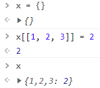

# 아이템 16

## number 인덱스 시그니처보다는 Array, 튜플, ArrayLike를 사용

---

1. 배열은 객체이므로 키킄 숫자가 아니라 문자열
2. 인덱스 시그니처로 사용된 number 타입은 버그를 잡기 위한 순수 타입스크립트 코드
3. 인덱스 시그니처에 number 보다는 Array나 튜플, ArrayLike 사용 권장

---

### 자바스크립트의 암시적 타입 강제

JS에서 객체란 키/값 쌍의 모음이며 키는 보통 문자열이고 값은 뭐든지 가능

파이썬이나 자바에서 볼 수 있는 ‘해시 가능’ 객체라는 표현이 자바스크립트에는 없음

더 복잡한 객체를 키로 사용하려 하면 toString 메서드가 호출되어 객체가 문자열로 변환됨



**숫자는 키로 사용할 수 없음** → 속성 이름으로 숫자를 사용하려 하면 JS 런타임은 **문자열로 변환**함


(key인 1은 숫자가 아니라 문자열)

**배열**의 경우

배열은 객체(object)이므로 숫자 인덱스를 사용하는 것이 당연


→ 앞의 인덱스들은 문자열로 변환되어 사용

→ 문자열 키를 사용해도 배열의 요소에 접근할 수 있음


Object.keys를 이용해 배열의 키를 나열해 보면 키가 문자열로 출력


---

### 타입스크립트 : 숫자 키와 문자키 구분

```tsx
interface Array<T> {
	// ...
	[n: number]: T;
}
```

런타임에는 ECMAScript 표준이 서술하는 것처럼 문자열 키로 인식하므로 이 코드는 완전히 가상이라 할 수 있지만, 타입 체크 시점에 오류를 잡을 수 있어 유용

```tsx
const xs = [1, 2, 3];
const x0 = xs[0];       // OK
const x1 = xs['1'];     // 인덱스 식이  'number; 형식이 아니므로 
                        // 요소에 암시적으로 'any' 형식이 있습니다.

function get<T> (array: T[], k: string): T {
    return array[k];    
    // 인덱스 식이 'number' 형식이 아니므로 
    // 요소에 암시적으로 'any' 형식이 있습니다.
}
```

이 코드는 실제로 동작하지 않고 타입 정보는 런타임에 제거됨

Object.keys는 문자열로 반환

```tsx

const keys = Object.keys(xs);   // 타입이 string[]
for (const key in xs) {
    key;                // 타입이 string
    const x = xs[key];  // 타입이 number
}
```

string이 number에 할당될 수 없지만 배열을 순회하는 코드 스타일에 대한 실용적인 허용으로 코드가 동작함(마지막 줄의 의문)

인덱스에 신경쓰지 않는다면 이런식의 반복이 아니라 for - of 사용

```tsx
for (const x of xs) {
    x;  // 타입이 number
}
```

인덱스의 타입이 중요하면 number 타입을 제공하는 forEach 사용

```tsx
xs.forEach((x, i) => {
    i;  // 타입이 number
    x;  // 타입이 nubmer
})
```

루프 중간에 멈춰야 한다면 C 스타일인 for(;;) 루프 권장

```tsx
for (let i = 0; i < xs.length; i++){
    const x = xs[i];
    if (x < 0) break;
}
```

※ 타입이 불확실하다면 for - in 루프는 for - of 또는 C 스타일의 for 루프보다 몇 배 느림

인덱스 시그니처가 number로 표현되어 있다면 입력한 값이 number여야 한다는 것을 의미하지만(for - in 루프 제외), **실제 런타임에서 사용되는 키는 string 타입** 

일반적으로 string 대신 number를 타입의 인덱스로 사용해야 하는 이유는 많지 않음

만약 **숫자**를 사용하여 인덱스할 항목을 지정한다면 **Array 또는 튜플 타입**을 대신 사용하게 될 것임

number를 인덱스 타입으로 사용하면 숫자 속성이 어떤 특별한 의미를 지닌다는 오해를 야기할 수 있음

어떤 길이를 가지는 배열과 비슷한 형태의 튜플을 사용하고 싶다면 타입스크립트의 ArrayLike 타입 사용

```tsx
function checkedAccess<T> (xs: ArrayLike<T>, i: number): T {
    if (i < xs.length) { 
        return xs[i];
    }
    throw new Error(`배열의 끝을 지나서 ${i}에 접근하려 했습니다.`)
}
```

위 예제는 길이와 숫자 인덱스 시그니처만 있음

**※ ArrayLike를 사용하더라도 키는 여전히 문자열임 ※**

```tsx
const tupleLike: ArrayLike<string> = {
    '0': 'A',
    '1': 'B',
    length: 2
};  // 정상
```